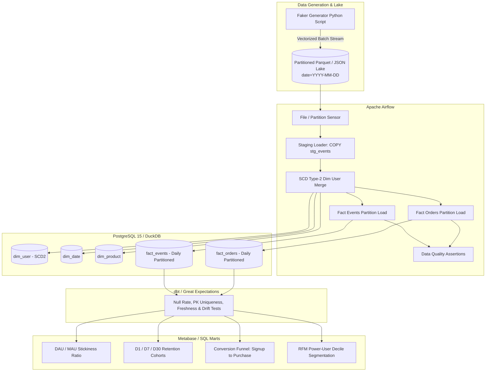

# Product Analytics Data Warehouse 🚀

> **End-to-End Dimensional Data Warehouse, Incremental ETL, and Growth Analytics Engine**

---

## 📌 Executive Summary & Architecture

This project implements a production-grade product analytics data warehouse modeled after modern distributed big data architectures. It simulates **1,000,000+ granular product interaction telemetry events** (signups, logins, posts, likes, purchases) with power-law activity distribution, loads them via an **idempotent Apache Airflow DAG**, models them into a **Kimball Star Schema with Type-2 Slowly Changing Dimensions (SCD-2)**, and evaluates core North Star product metrics (DAU/MAU stickiness, cohort retention, conversion funnels, and power-user segmentation).



---

## 📂 Repository Directory Layout

```text
├── data_generator/
│   ├── __init__.py
│   └── generate_events.py          # Vectorized Faker generator (1M+ events to Parquet)
├── warehouse/
│   ├── schema/
│   │   ├── 01_dimensions.sql       # dim_user (SCD-2), dim_date, dim_product
│   │   ├── 02_facts.sql            # fact_events, fact_orders (Daily Range Partitioned)
│   │   └── 03_indexing_and_partitions.sql # BRIN, GIN (JSONB), Composite B-Tree
│   └── duckdb_init.sql             # Instant in-process DuckDB warehouse initialization
├── dags/
│   ├── product_analytics_etl_dag.py# Airflow daily incremental ETL pipeline
│   └── sql/
│       └── scd2_user_merge.sql     # Pure SQL SCD Type-2 upsert logic
├── analytics/
│   ├── 01_dau_mau_ratio.sql        # DAU/MAU stickiness with 7d moving average
│   ├── 02_retention_cohorts.sql    # D1, D7, D14, D30 cohort retention matrix
│   ├── 03_conversion_funnel.sql    # Chronological step-by-step conversion funnel
│   └── 04_user_segmentation.sql    # NTILE/Percentile user tiering (Pareto analysis)
├── dbt_project/
│   ├── dbt_project.yml             # dbt core configuration
│   ├── models/
│   │   ├── staging/sources.yml     # Freshness SLAs (warn_after 12h, error 24h)
│   │   └── schema.yml              # Null, unique, referential integrity tests
│   └── tests/
│       └── assert_row_count_drift.sql # Custom anomaly test (DoD drift > 30%)
├── data_quality/
│   └── great_expectations_suite.py # Programmatic Python assertions suite
├── docker-compose.yml              # Multi-container stack (Airflow + Postgres + Metabase)
├── requirements.txt                # Python environment lockfile
└── README.md                       # Architecture blueprint & deployment documentation
```

---

## 🗄️ Dimensional Star Schema Design

### Entity-Relationship Architecture

```text
                  +---------------------------+
                  |         dim_date          |
                  +---------------------------+
                  | PK  date_id (YYYYMMDD)    |
                  |     calendar_date         |
                  |     year, quarter, month  |
                  |     is_weekend, is_holiday|
                  +-------------+-------------+
                                |
                                | 1:N
   +----------------------------+----------------------------+
   |                                                         |
   v                                                         v
+-----------------------------+               +-----------------------------+
|         fact_events         |               |         fact_orders         |
|   (Daily Range Partition)   |               |   (Daily Range Partition)   |
+-----------------------------+               +-----------------------------+
| PK  event_date              |               | PK  order_date              |
| PK  event_sk                |               | PK  order_sk                |
|     event_id (UUID)         |               |     order_id                |
| FK  user_sk                 |               | FK  user_sk                 |
|     user_id                 |               |     user_id                 |
|     platform (ios/android)  |               | FK  product_sk              |
|     event_type              |               |     order_amount            |
|     session_id              |               |     payment_gateway         |
|     metadata (JSONB)        |               |     order_status            |
+--------------+--------------+               +--------------+--------------+
               |                                             |
               +----------------------+----------------------+
                                      | N:1
                                      v
                        +---------------------------+
                        |   dim_user (SCD Type-2)   |
                        +---------------------------+
                        | PK  user_sk               |
                        |     user_id (Natural Key) |
                        |     country               |
                        |     preferred_platform    |
                        |     user_tier             |
                        |     valid_from            |
                        |     valid_to              |
                        |     is_current (Boolean)  |
                        +---------------------------+
```

### Slowly Changing Dimension (SCD Type-2) Strategy
User attributes (such as country relocation, operating platform switch, or tier upgrades) evolve. Rather than overwriting (`SCD-1`), which corrupts historical attribution:
- Each state transition closes the predecessor row by setting `valid_to = event_timestamp` and `is_current = FALSE`.
- A new surrogate key `user_sk` is generated with `valid_from = event_timestamp`, `valid_to = '9999-12-31'`, and `is_current = TRUE`.
- Analytical queries perform **Point-in-Time (PIT)** joins using:
  ```sql
  WHERE event_timestamp >= dim_user.valid_from 
    AND event_timestamp <  dim_user.valid_to
  ```

---

## ⚡ Indexing & Partitioning Strategy (High-Throughput Principles)

1. **Declarative Range Partitioning by Day**:
   - `fact_events` and `fact_orders` are partitioned on `event_date` and `order_date`.
   - Analytical queries containing date bounds trigger **Partition Pruning** at query planning time, bypassing 95%+ of table blocks.
2. **BRIN (Block Range Index) on Event Timestamps**:
   - Facts arrive sequentially. BRIN indexes maintain min/max boundaries per disk block range (128 pages), taking `< 1%` of the storage of traditional B-Trees while accelerating intra-day range scans.
3. **Composite B-Tree Indexes**:
   - `(user_id, event_type)` ensures high-speed cohort membership and conversion funnel lookups.
4. **GIN Indexing on JSONB**:
   - Variable metadata payloads utilize `jsonb_path_ops` GIN indexing for sub-millisecond document filter execution.

---

## 🔄 Daily Incremental ETL Pipeline (Airflow DAG)

### Idempotency Guarantee
The pipeline uses the **Partition Overwrite / Delete-Insert** pattern tied to Airflow's logical execution date `{{ ds }}`:
```sql
DELETE FROM analytics.fact_events WHERE event_date = '{{ ds }}'::DATE;
INSERT INTO analytics.fact_events (...) SELECT ... WHERE event_date = '{{ ds }}'::DATE;
```
If an upstream task fails or a backfill is triggered, re-running the DAG produces **deterministic, duplicate-free results**.

---

## 📊 Core Analytical Metrics

### 1. DAU / MAU Stickiness Ratio
- **Formula**: $\text{Stickiness} = \frac{\text{DAU}}{\text{MAU}} \times 100\%$
- **Purpose**: Core industry engagement benchmark for product habituation. Smooths day-of-week fluctuations using a 7-day trailing moving average window.

### 2. User Retention Cohorts
- **Granularity**: Day-1, Day-7, Day-14, and Day-30.
- **Methodology**: Cohort date established at earliest user activity; trailing activity days computed through calendar difference CTEs.

### 3. Chronological Conversion Funnel
- **Steps**: $\text{Signup} \longrightarrow \text{Login} \longrightarrow \text{Post / Like} \longrightarrow \text{Purchase}$
- **Enforcement**: Strict temporal monotonicity ($t_{\text{signup}} \le t_{\text{login}} \le t_{\text{post/like}} \le t_{\text{purchase}}$).

### 4. Power-User Decile Segmentation (Pareto Distribution)
- Uses `NTILE(10)` and `PERCENT_RANK()` across trailing 30-day interaction depth to segment users into **Power Creators (Top 5%)**, **Core Engagers (Next 15%)**, **Casual Consumers (40%)**, and **Light Users (40%)**.

---

## 🛡️ Data Quality & SLA Framework

| Check Category | Implementation | Threshold / SLA |
| :--- | :--- | :--- |
| **Data Freshness** | `dbt source freshness` | Warn @ 12 hrs, Fail @ 24 hrs |
| **Completeness** | `not_null` constraint | 0.00% Null rate on critical keys |
| **Uniqueness** | `unique` constraint | 100% Unique on `event_id`, `user_sk`, `order_id` |
| **Referential Integrity** | `relationships` test | Fact `user_sk` must exist in `dim_user` |
| **Row Count Drift** | Custom SQL Test | DoD deviation $\le \pm 30\%$ against 7d baseline |

---

## 🚀 Step-by-Step Deployment Guide

### Prerequisites
- Docker & Docker Compose v2+
- Python 3.10+

### Option A: Local Quickstart with DuckDB (No Docker required)

```bash
# 1. Install dependencies
pip install -r requirements.txt

# 2. Generate 1,000,000 events partitioned into Parquet files
python data_generator/generate_events.py --records 1000000 --users 50000 --days 30

# 3. Query immediately with DuckDB
duckdb -init warehouse/duckdb_init.sql
```

Inside the DuckDB CLI, execute any analytics script:
```sql
.read analytics/01_dau_mau_ratio.sql
.read analytics/02_retention_cohorts.sql
.read analytics/03_conversion_funnel.sql
.read analytics/04_user_segmentation.sql
```

---

### Option B: Full Production Stack via Docker Compose

```bash
# 1. Start Postgres, Airflow, and Metabase
docker compose up -d

# 2. Verify container health
docker compose ps

# 3. Access interfaces:
# - Airflow UI:   http://localhost:8080 (User: admin / Pass: admin)
# - Metabase BI:  http://localhost:3000
# - Postgres DWH: localhost:5432 (DB: warehouse, User: postgres, Pass: postgres)

# 4. Trigger the ETL DAG in Airflow:
docker compose exec airflow-webserver airflow dags trigger product_analytics_daily_etl
```
